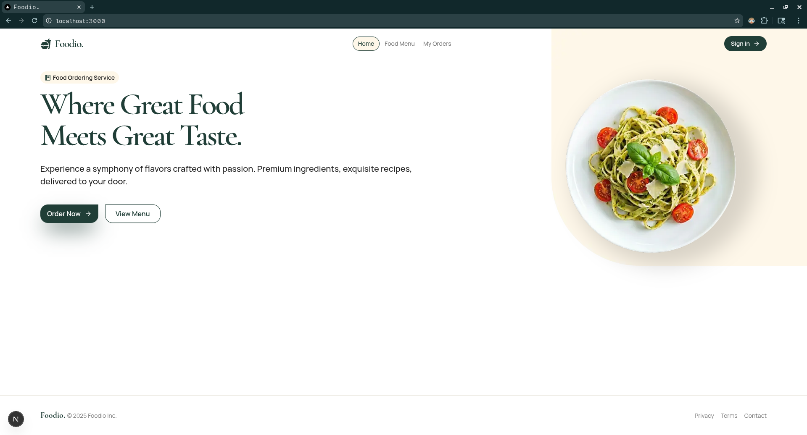
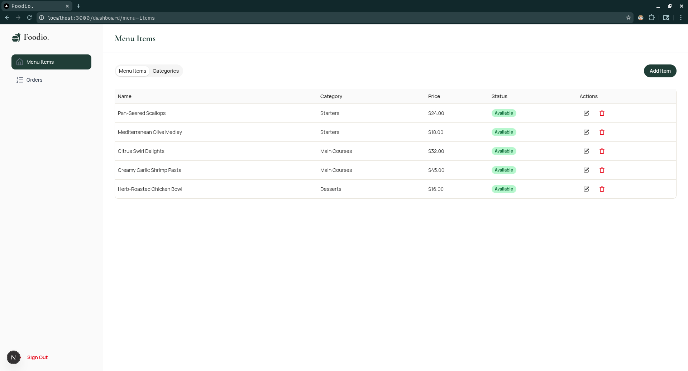
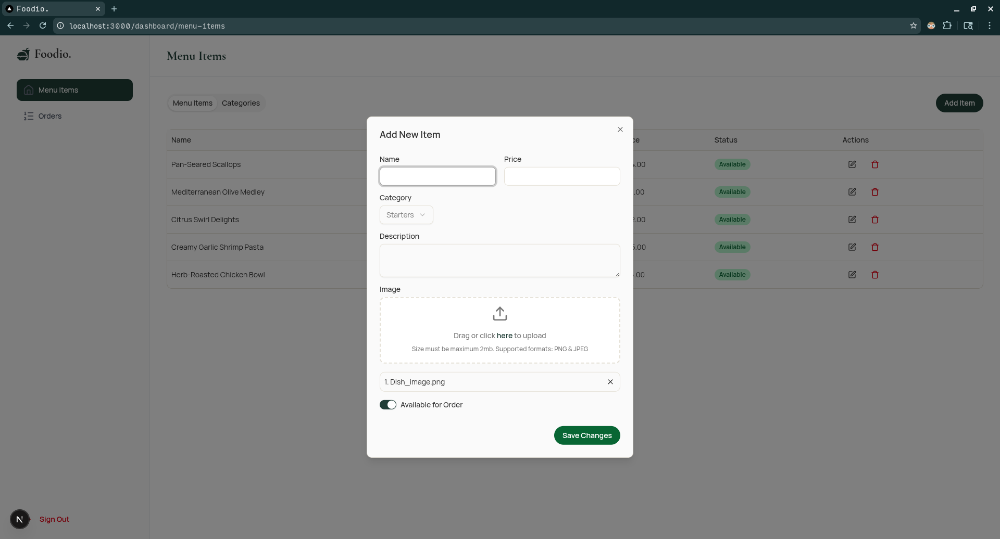
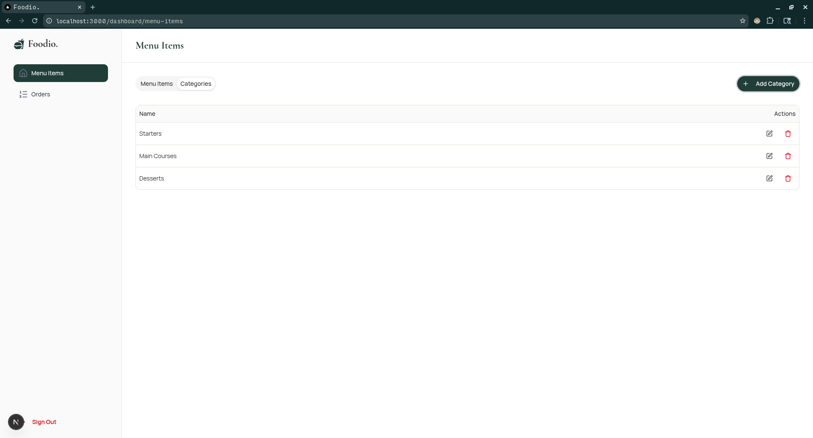
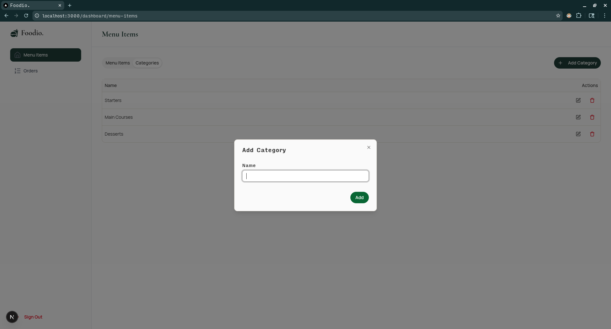
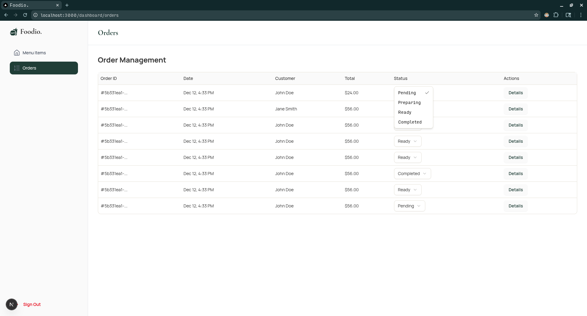
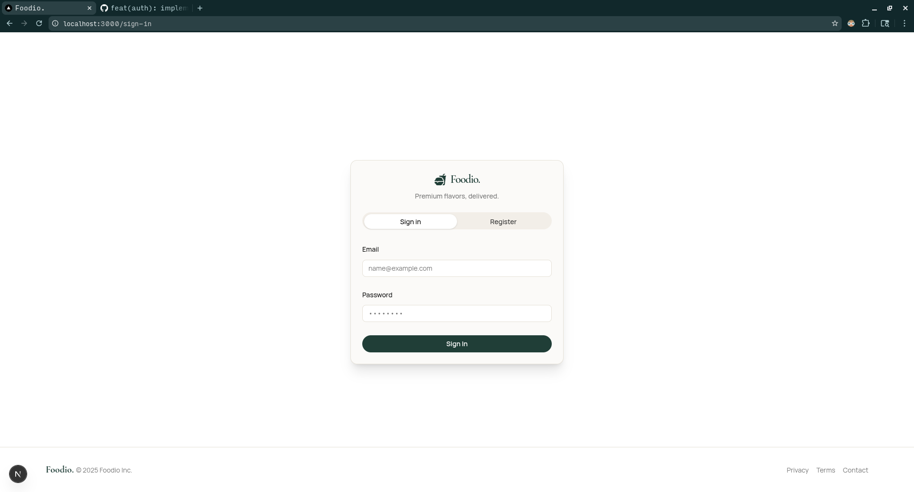

# Foodio Frontend

This is the frontend for the Foodio application, a food ordering platform.

## Getting Started

Follow these instructions to get a copy of the project up and running on your local machine for development and testing purposes.

### Prerequisites

Make sure you have the following installed on your system:

- [Node.js](httpss://nodejs.org/) (v20 or later)
- [pnpm](httpss://pnpm.io/)

### Installation

1.  Clone the repository to your local machine:

    ```bash
    git clone https://github.com/your-username/foodio-frontend.git
    ```

2.  Navigate into the project directory:

    ```bash
    cd foodio-frontend
    ```

3.  Install the dependencies using pnpm:
    ```bash
    pnpm install
    ```

## Available Scripts

In the project directory, you can run:

### `pnpm dev`

Runs the app in the development mode.<br />
Open [http://localhost:3000](http://localhost:3000) to view it in the browser.

The page will reload if you make edits.<br />
You will also see any lint errors in the console.

### `pnpm build`

Builds the app for production to the `.next` folder.<br />
It correctly bundles React in production mode and optimizes the build for the best performance.

### `pnpm start`

Starts the production server.<br />
You should run `pnpm build` before this command.

### `pnpm lint`

Runs the linter to check for code quality and style issues.

## Screenshots

| Screenshot                                             |
| ------------------------------------------------------ |
|  |
|  |
|  |
|  |
|  |
|  |
|  |
